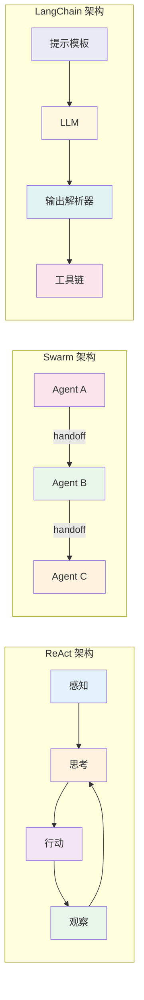

# Agent 原理与最简实践

## 第一部分：Agent 原理深度解析

### Agent 核心概念

Agent（智能体）是能够感知环境、做出决策并采取行动以实现特定目标的自主实体。与传统程序相比，Agent 具备以下核心特征：

- **自主性**：无需人工干预即可独立运行
- **反应性**：能对环境变化做出实时响应
- **主动性**：主动追求目标而非被动响应
- **社会性**：能与其他 Agent 或人类进行交互

### ReAct 架构详解

ReAct（Reasoning + Acting）是目前最简洁有效的 Agent 架构，其核心思想是：

```
观察环境 → 思考推理 → 采取行动 → 观察结果 → 循环
```

**ReAct 决策循环**：
1. **Thought**：基于当前观察进行推理
2. **Action**：选择并执行具体行动
3. **Observation**：观察行动结果
4. **循环**：根据新观察继续思考


**示例流程**：
```
用户："北京天气如何？"
Thought：用户询问天气，需要获取北京当前天气信息
Action：weather_query(location="北京")
Observation：{"temperature": 25, "condition": "晴"}
Thought：已获得天气数据，可以回复用户
Action：回复"北京今天25度，晴天"
```

### OpenAI Swarm Agent 架构

OpenAI Swarm 是一个轻量级的多 Agent 编排框架，核心特点：

**核心组件**：
- **Agent**：具有指令和功能的独立单元
- **Handoffs**：Agent 之间转移对话控制权
- **Context Variables**：Agent 间共享的上下文数据

**Swarm 架构特点**：
- 高度可控（比 LangGraph 更轻量）
- 易于测试和迭代
- 支持 Agent 间的无缝切换
- 教育用途友好

**Swarm Agent 定义**：
```python
agent = Agent(
    name="Weather Agent",
    instructions="你是一个天气助手，使用工具获取天气信息",
    functions=[get_weather, convert_temperature]
)
```

### 其他主流 Agent 架构

**LangChain Agent**：
- 基于链式调用的 Agent 框架
- 支持多种提示模板
- 丰富的工具集成生态
- 适合复杂工作流

**AutoGPT**：
- 完全自主的目标追求
- 长期记忆系统
- 自我提示生成
- 适合开放式任务

**架构对比**：

| 架构 | 复杂度 | 控制力 | 适用场景 |
|------|--------|--------|----------|
| ReAct | 低 | 高 | 简单决策任务 |
| Swarm | 中 | 高 | 多 Agent 协作 |
| LangChain | 高 | 中 | 复杂工作流 |
| AutoGPT | 高 | 低 | 自主探索任务 |



## 第二部分：从零实现最简 Agent

### 最简 ReAct Agent 实现

**Agent 内部数据流**：


以下是一个 50 行代码实现的完整 ReAct Agent：

```python
import json
from typing import Dict, List, Any

class ReActAgent:
    def __init__(self, tools: Dict[str, callable], system_prompt: str):
        self.tools = tools
        self.system_prompt = system_prompt
        self.history = []
    
    def think(self, query: str) -> str:
        """思考下一步行动"""
        prompt = f"""{self.system_prompt}

当前问题：{query}
可用工具：{list(self.tools.keys())}
历史记录：{self.history}

请用以下格式回复：
Thought: 你的思考过程
Action: 工具名称
Action Input: 工具输入参数
"""
        return prompt
    
    def act(self, action: str, action_input: str) -> str:
        """执行行动"""
        if action in self.tools:
            try:
                result = self.tools[action](json.loads(action_input))
                return str(result)
            except Exception as e:
                return f"错误：{str(e)}"
        return "无效的工具"
    
    def run(self, query: str, max_steps: int = 5) -> str:
        """运行 Agent"""
        for step in range(max_steps):
            thought_prompt = self.think(query)
            response = self.get_llm_response(thought_prompt)
            
            # 解析响应
            lines = response.strip().split('\n')
            thought = None
            action = None
            action_input = None
            
            for line in lines:
                if line.startswith('Thought:'):
                    thought = line[8:].strip()
                elif line.startswith('Action:'):
                    action = line[7:].strip()
                elif line.startswith('Action Input:'):
                    action_input = line[13:].strip()
            
            if not action or action == "None":
                return thought or response
            
            # 执行行动
            observation = self.act(action, action_input)
            self.history.append({
                'step': step + 1,
                'thought': thought,
                'action': action,
                'action_input': action_input,
                'observation': observation
            })
            
            if "错误" not in observation:
                return observation
        
        return "达到最大步骤限制"
    
    def get_llm_response(self, prompt: str) -> str:
        """这里应该调用实际的 LLM API，这里用模拟数据"""
        # 实际实现时替换为真实的 LLM 调用
        return "Thought: 需要获取信息\nAction: search\nAction Input: {\"query\": \"相关信息\"}"

# 使用示例
def search_tool(params):
    return f"搜索结果：{params['query']} 的相关信息"

def calculator_tool(params):
    return str(eval(params['expression']))

# 创建 Agent
tools = {
    'search': search_tool,
    'calculate': calculator_tool
}

agent = ReActAgent(tools, "你是一个有帮助的助手")
result = agent.run("计算 15*3 等于多少")
print(result)
```

### 关键实现要点

1. **ReAct 循环模式**：思考-行动-观察的循环是 Agent 的核心
2. **工具集成**：通过函数封装将外部能力整合到 Agent 中
3. **错误处理**：完善的异常处理确保 Agent 稳定运行
4. **提示工程**：清晰的系统提示指导 Agent 行为
5. **状态管理**：历史记录帮助 Agent 保持上下文连贯性

