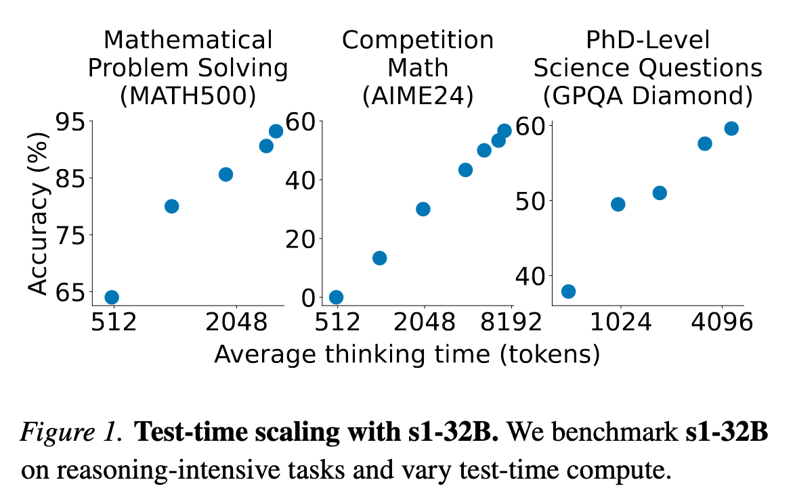

# S1: Thinking Budget with vLLM

首先，我们来了解一下AI教母李飞飞教授关于 Test-time scaling 的论文：[*《s1: Simple test-time scaling》*](http://arxiv.org/abs/2501.19393)

<div align='center'>
    
</div>

论文大致讲了个什么事情呢？简单来说，提出了一种新的测试时间缩放方法，旨在提高模型在推理阶段的效率和准确性。通过调整模型的思考预算，可以在不同的任务和数据集上实现更好的性能。

就是说对于一些复杂问题，需要用推理链来解决的问题，我们可以通过调整模型的思考预算来提高推理效率和准确性。上图也可以看到当思考预算增加时，模型的性能会有明显提升。

<div align='center'>
    
</div>


插一句题外话，论文中判断问题难易程度的方式是通过让 Qwen2.5-32B-Instruct 模型回答问题，答对的问题就是简单问题，答错的就是复杂问题。

<div align='center'>
    
</div>


论文也做了消融实验来探讨，在未满足思考预算时插入一些不同的特定词（如：Wait！）对模型最终性能的影响。结果表明，插入特定词可以有效地引导模型进行更深入的思考，并且“Wait，Wait”的效果最好。

## 代码实现

我们使用 vLLM 来实现模型的思考预算。vLLM 是一个高性能的推理引擎，支持大规模语言模型的高效推理。以下为代码实现的步骤：

<div align='center'>
    
</div>

左侧为不使用思考预算的推理过程，右侧为使用思考预算的推理过程。可以看到，使用思考预算后，模型会在推理过程中插入特定词来引导模型进行更深入的思考。

以下为核心代码实现，完整代码请参考 [*s1.py*](./s1.py)

```python
def run_thinking_budget_sample(llm_model, tokenizer, user_input, thinking_budget):
    input_text = build_input(user_input, tokenizer)
    input_token_count = count_token(input_text, tokenizer)

    iteration_count= 0
    max_token = input_token_count + thinking_budget

    sampling_params = SamplingParams(
        temperature=0.7,
        max_tokens=4096,
        skip_special_tokens=False
    )

    think_token_count = 0

    while True:

        wait_sampling_params = SamplingParams(
            temperature=0.7,
            max_tokens=thinking_budget - think_token_count,
            stop='</think>',
            skip_special_tokens=False
        )

        outputs = llm_model.generate(
            input_text,
            wait_sampling_params
        )
        total_token, think_token_count = count_thinking_token(outputs, tokenizer)

        print(f'第{iteration_count}次迭代，思考token数：{think_token_count}')

        if think_token_count > thinking_budget:
            break
        input_text = total_token + "\nWait!\n"

        # \nWait a moment. Was there any loophole in my thought just now?!\n
        # \nWait!\n

        iteration_count += 1

    final_outputs = llm_model.generate(
        outputs[0].prompt + outputs[0].outputs[0].text + "\n</think>\n",
        sampling_params
    )   
    
    total_content = final_outputs[0].prompt + final_outputs[0].outputs[0].text
    thinking_content = total_content.split("<think>")[-1].split("</think>")[0]

    print(total_content)

    print(f"迭代次数：{iteration_count}, 输入token数：{input_token_count}, 思考token数：{count_token(thinking_content, tokenizer)}, 总token数：{count_token(total_content, tokenizer)}")
```

首先是要定义一个函数 `run_thinking_budget_sample`，该函数接收模型、tokenizer、用户输入和思考预算作为参数。然后构建输入文本并计算输入的 token 数量。

因为`max_tokens` 参数是指生成的最大 token 数量，所以我们需要计算输入文本的 token 数量，并将其与思考预算相加，得到 `max_token = thinking_budget - think_token_count`。如果思考 token 数量超过了思考预算，就停止迭代。另外还需要在 `SamplingParams` 中设置 `stop` 参数为 `</think>`，这样模型在生成文本时会在遇到 `</think>` 时停止生成。

```python
wait_sampling_params = SamplingParams(
    temperature=0.7,
    max_tokens=thinking_budget - think_token_count,
    stop='</think>',
    skip_special_tokens=False
)
```

另外还需要在每次迭代中，使用 `llm_model.generate` 方法生成文本，并计算思考 token 数量。如果思考 token 数量超过了思考预算，就停止迭代。否则，将生成的文本添加到输入文本中，并在文本末尾添加 `\nWait!\n`，以引导模型进行更深入的思考。

```python
while True:
    wait_sampling_params = SamplingParams(
        temperature=0.7,
        max_tokens=thinking_budget - think_token_count,
        stop='</think>',
        skip_special_tokens=False
    )

    outputs = llm_model.generate(
        input_text,
        wait_sampling_params
    )
    total_token, think_token_count = count_thinking_token(outputs, tokenizer)

    print(f'第{iteration_count}次迭代，思考token数：{think_token_count}')

    if think_token_count > thinking_budget:
        break
    input_text = total_token + "\nWait!\n"

    # \nWait a moment. Was there any loophole in my thought just now?!\n
    # \nWait!\n

    iteration_count += 1
```

当达到思考预算后，使用 `llm_model.generate` 方法生成最终的输出文本，并将其打印出来。最后输出迭代次数、输入 token 数量、思考 token 数量和总 token 数量。

```python
final_outputs = llm_model.generate(
    outputs[0].prompt + outputs[0].outputs[0].text + "\n</think>\n",
    sampling_params
)   

total_content = final_outputs[0].prompt + final_outputs[0].outputs[0].text
thinking_content = total_content.split("<think>")[-1].split("</think>")[0]

print(total_content)

print(f"迭代次数：{iteration_count}, 输入token数：{input_token_count}, 思考token数：{count_token(thinking_content, tokenizer)}, 总token数：{count_token(total_content, tokenizer)}")
```

此时我们还需要另外一个 `SamplingParams` 对象来设置最终生成文本的参数。`max_tokens` 参数设置为 4096，模型根据思考过程进行总结最后得出答案，这个过程也需要很多tokn，此时设置为多少都可以，通常设置为一个较大的值即可。

```python
sampling_params = SamplingParams(
    temperature=0.7,
    max_tokens=4096,
    skip_special_tokens=False
)
```

以上为核心代码实现，完整代码请参考 [*s1.py*](./s1.py)。在实际使用中，可以根据具体的任务和数据集调整思考预算和其他参数，以获得更好的性能。

## 结果分析

使用思考预算后，模型在推理过程中能够更深入地思考问题，从而提高了推理效率和准确性。但是也发现了一些有趣的现象。

例如，在某些情况下，就算插入了`Wait!`，模型并不会按照论文中所示进行多种不同方式尝试解答，或是反思之前的思考过程是否正确。而且还会出现模型在思考过程中重复生成相同的内容，导致思考 token 数量超过思考预算的情况。

<div align='center'>
    
</div>

当然，也有可能本身测试的模型只有14B参数，导致其在思考过程中的能力受到限制。

经过测试下来，有可能强行使用特定词（如：Wait!）来引导模型进行更深入的思考，可能会促使模型产生 “一条道走到黑” 的想法。

部分实验测试记录在 [*output*](./output/) 中。